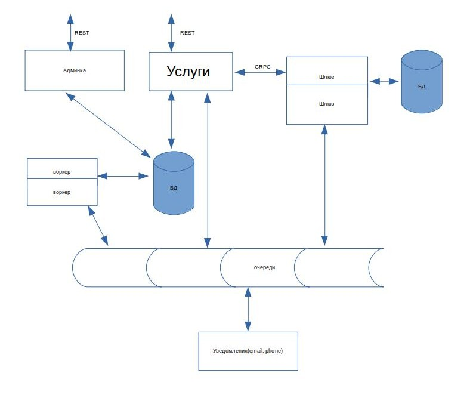
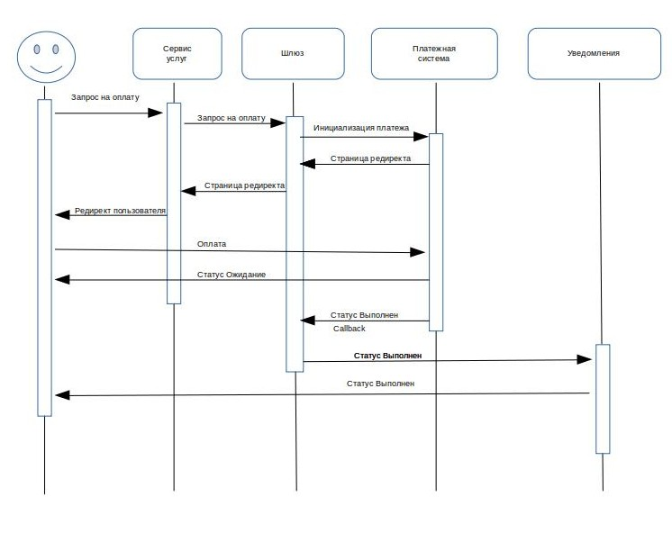

# Архитектура Сервиса

# Клиентский сценарий 

# REST API Сервиса

## Получить услугу

### Request

`GET /service/1`

### Response

    HTTP/1.1 200 OK

    {"id":1, "price": 10000, "name":"Сервис","description":"Подбор авто"}

    HTTP/1.1 404 Not Found

    {"status":404,"reason":"Not found"}

## Получить список услуг

### Request

`GET /services?page=1&limit=2`

### Response

    HTTP/1.1 200 OK

    {
        data:[
            {
                "id":1,
                "name":"Сервис",
                "price": 10000,
                "description":"Подбор авто"
            },
            {
                "id":2,
                "name":"Сервис",
                "price": 1500,
                "description":"Проверка документов авто"
            }
        ],
        panition: {
            "limit":2,
            "total": 10,
            "page": 1
        }
    }

    HTTP/1.1 404 Not Found

    {"status":404,"reason":"Not found"}

## Сделать заказ

### Request

`POST /orders`

{
    services:[
        {
            "id":1
        },
        {
            "id":2
        }
    ]
}

### Response

    HTTP/1.1 201 Created
    
    {"id":1}

   HTTP/1.1 404 Not Found

   {"status":404,"reason":"Not found"}

## Запрос на оплату

### Request

`POST /payment`

    {
        order_id: 1,
        type_payment:1
    }

### Response

   HTTP/1.1 301 Moved Permanently 

   HTTP/1.1 404 Not Found

    {"status":404,"reason":"Not found"}

# REST API Админки

## Создать услугу

### Request

`POST /service`

### Response

    HTTP/1.1 201 Created

    {"id":1,"name":"Сервис", "price": 10000,"description":"Подбор авто"}

    HTTP/1.1 400 Bad request

    {"status":400,"reason":"Incorrect description"}

## Изменить аттрибуты услуги

### Request

`PUT /service/2`

{"name":"Сервис", "price": 20000, "description":"Проверка документов авто"}

### Response

    HTTP/1.1 200 OK

    {"id":2,"name":"Сервис", "price": 20000, "description":"Проверка документов авто"}

    HTTP/1.1 404 Not Found

    {"status":400,"reason":"Incorrect description"}
